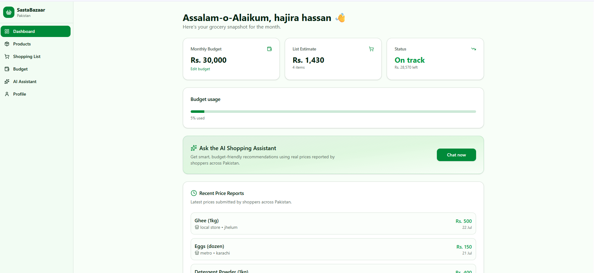
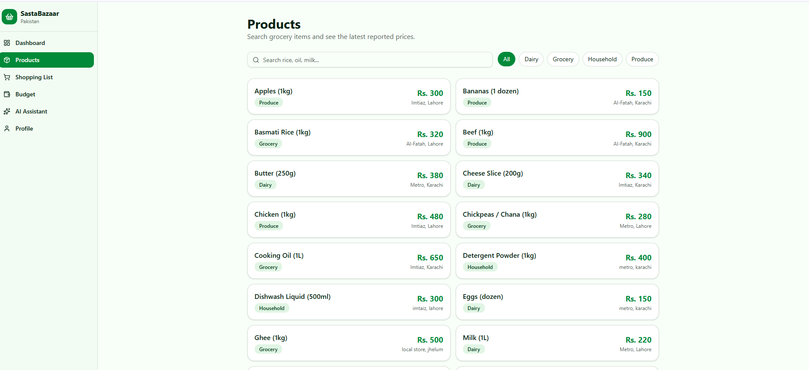
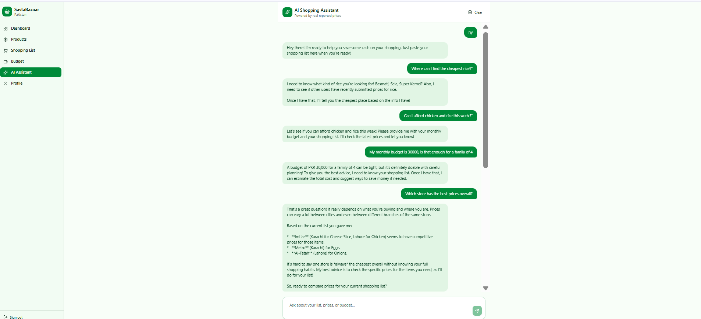
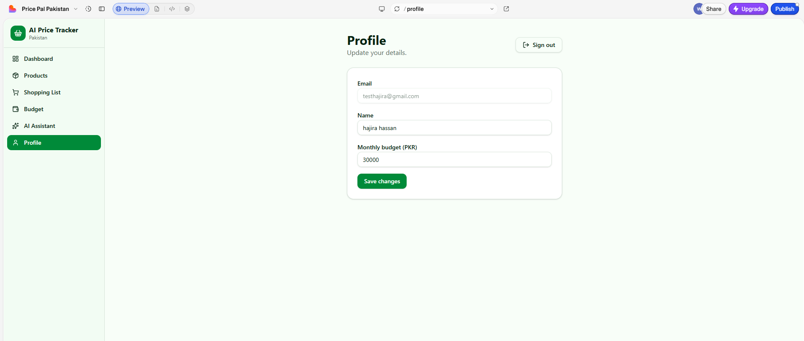

# AI Price Tracker for Pakistan

## a. What it does & the problem it solves

**AI Price Tracker** is a web app that helps Pakistani households track and compare grocery prices across different stores and cities. Due to constant inflation, people rarely know whether they're paying a fair price for everyday items like rice, chicken, or cooking oil — and there's no shared, trustworthy source of current prices from real stores.

AI Price Tracker solves this by letting users **report prices they see in stores**, building a crowdsourced price database that anyone can browse. Users can also build a shopping list against a monthly budget, and ask an AI assistant for personalized, budget-aware shopping advice based on real reported prices — not guesses.

**Who it's for:** Families, students, housewives, and daily shoppers in Pakistan who want a clearer, community-driven picture of grocery prices before they shop — without relying on any single store's app or word of mouth.

## b. Live URL

🔗 **https://pricepal-pakistan.lovable.app**

Anyone can open this link, sign up, and start using the app immediately — no invite or approval needed.

## c. Features

- **Secure signup/login** — email + password authentication (Supabase Auth), with sign out available from the sidebar
- **Products catalog** — browse grocery and household items by category (Grocery, Dairy, Produce, Household)
- **Report a price** — any user can submit a price they saw for a product (store name, city, price)
- **Price history per product** — see all reported prices for an item, sorted by most recent
- **Dashboard overview** — monthly budget, current shopping list estimate, budget usage progress bar, and a live feed of recently reported prices from all users
- **Shopping List** — add products with quantities and see an estimated total cost, calculated from the latest reported price for each item
- **Budget Planner** — set a monthly budget and see at a glance whether your shopping list keeps you on track or over budget
- **AI Shopping Assistant** — a chat interface that gives personalized, budget-aware recommendations using real reported price data
- **Editable profile** — update name, email, and monthly budget at any time
- **Row-Level Security** — each user's private data (profile, budget, shopping lists) is protected at the database level; only price reports are shared publicly, since the whole point is crowdsourcing them

## d. The AI feature

**What it does:** The AI Shopping Assistant is a chat interface where users can ask free-text questions about their shopping. It has access to the user's shopping list, their monthly budget, and the most recent price reports submitted by other users for relevant products. It uses this real data to:

- Recommend the cheapest reliable store/price for items the user is asking about
- Flag if a reported price looks outdated
- Estimate the total cost of the user's shopping list
- Warn the user if their list is likely to go over budget, and suggest ways to cut cost
- Answer natural questions like *"Where can I find the cheapest rice?"* or *"Can I afford chicken and rice this week?"*

**System prompt used:**

You are a budget-conscious shopping assistant for users in Pakistan. You receive the user's
shopping list, their monthly budget, and recent price data submitted by other users for each
product (store name, city, price, date). Recommend the cheapest reliable option per item, note
if a price looks outdated (more than 30 days old), estimate the total cost of the list, and
tell the user clearly if they are over budget with specific suggestions to cut cost. Respond in
simple, friendly English, use PKR for currency, and be concise and practical like a helpful
friend rather than a formal analyst.


**Model used:** Accessed through the Lovable AI Gateway — no separate API key required, keeping the key off the client entirely and out of the codebase.

## e. Tools, services, and AI models used

- **[Lovable](https://lovable.dev)** — AI app builder used to build the full app (frontend, backend, and database) from natural-language prompts
- **Supabase** — authentication and PostgreSQL database, with Row-Level Security so private user data stays private while price reports remain public/crowdsourced
- **Lovable AI Gateway** — powers the AI Shopping Assistant feature
- **GitHub** — version control and public code hosting, synced directly from Lovable

## f. Screenshots

**Dashboard**


**Products & Price Reports**


**AI Shopping Assistant**


**Sign Up / Login**


## g. How to run the project

**Option 1 — Use the live app (recommended):**
Simply visit **https://pricepal-pakistan.lovable.app** and sign up with any email and password.

**Option 2 — Run locally from this repo:**

```bash
# Clone the repository
git clone https://github.com/whokookk4452-cmyk/price-pal-pakistan.git
cd price-pal-pakistan

# Install dependencies
npm install

# Set up environment variables
# Create a .env file with your own Supabase project URL and anon key:
# VITE_SUPABASE_URL=your_supabase_url
# VITE_SUPABASE_PUBLISHABLE_KEY=your_supabase_anon_key

# Run the development server
npm run dev
```

> Note: The AI Shopping Assistant depends on the Lovable AI Gateway and the Supabase project configuration set up in the hosted environment. For full functionality locally, connect your own Supabase project and configure the AI Gateway/API key accordingly.

---

**Author:** Farwa Hassan
**Project:** Final Project — Build & Ship Your Own AI App
